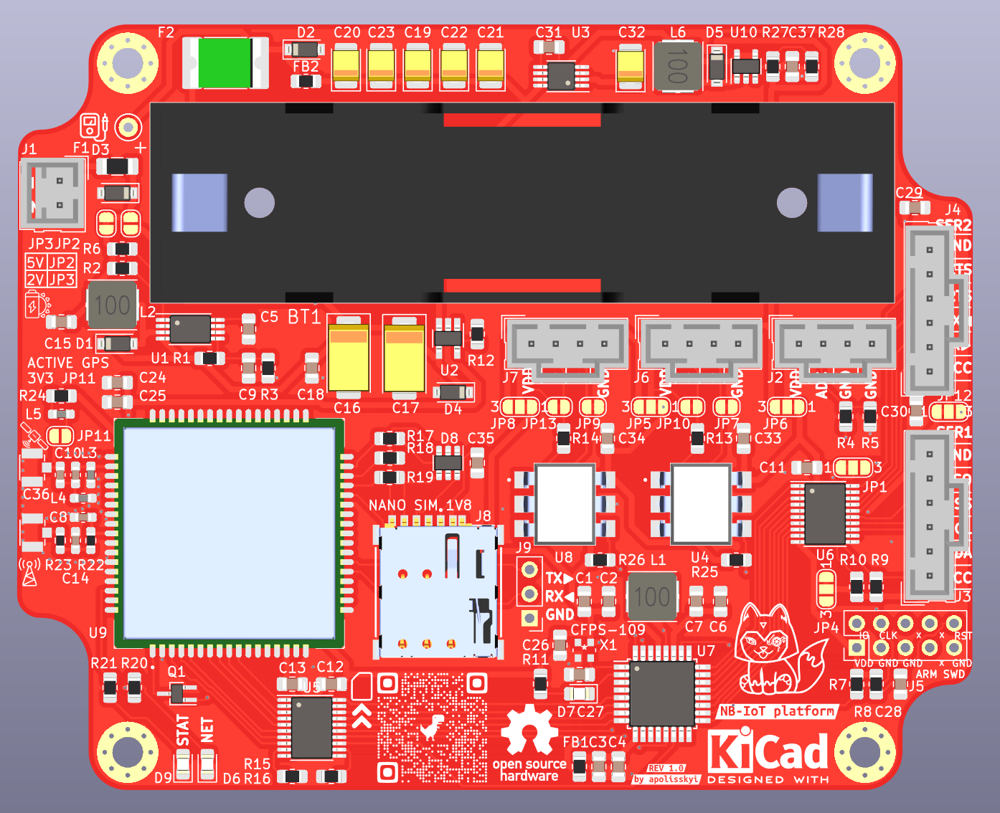
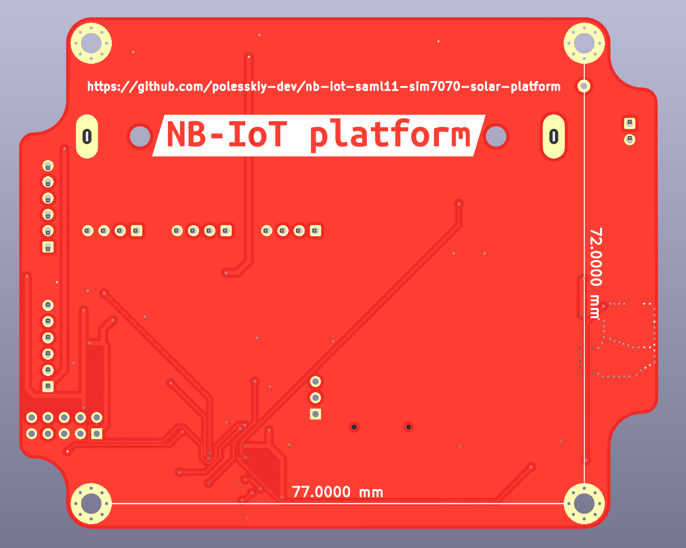

# NB IoT platform

### Based on:
* MCU: Microchip SAML11
* GSM: SIMCom SIM7070
* Power: 2V Solar panel or DC 5V, MPPT harvester, 1xLiFePO4 18650 

### Hardware features:
* Sensors IN: 
  * 2xPulse, 3V3-48V tolerant, optocouple galvanic isolation. Supports NPN, PNP
  * 1xADC, 3V3-48V tolerant
  * 2x4 wires: USART, LIN client, I2C client/host, SPI client/host, RS485 (3V3), 3V3-5V tolerant, buffered
* Sensors power OUT: 3V3, 12V or self-powered
* Power: 1V5-2V5 Solar MPPT Harvester or DC 5V, LiFePO4/Li-ion charger, reverse polarity protection
* [ ] power consumption values plot

### Software features:
* [ ] AWS integration
* [ ] MQTTs
* [ ] I2C BME280 temperature/humidity/pressure sensor support

### Schematics:

### Board:

### Enclosure:
Gainta G113

### BOM:
[Interactive BOM](docs/bom/ibom.html)

